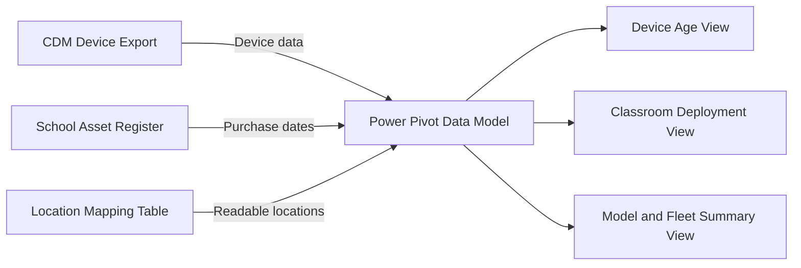
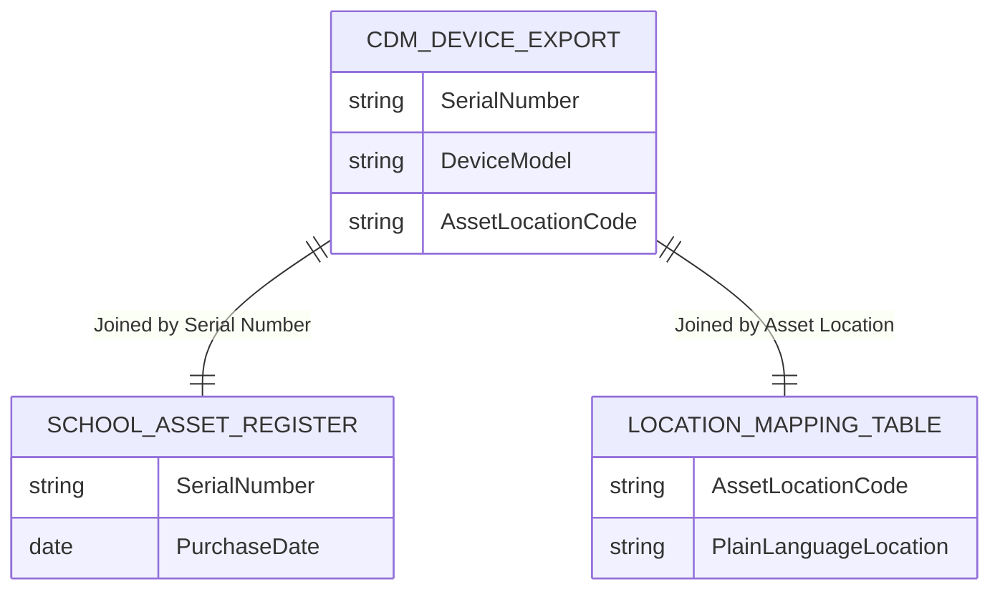

# Fleet Visibility Dashboard (CDM, Asset Register and Location Data)

## Summary

I created an Excel Power Pivot dashboard to give school leadership a clear view of the device fleet across a NSW public primary school. The dashboard joined CDM exports, the school asset register and a custom location table to show device age, model and classroom deployment in one place. This made it easier to prioritise replacements and identify where older devices were still in use.

~~~mermaid
flowchart TD
    subgraph Dimension_Tables["Lookup Tables (Dimensions)"]
        B[School Asset Register<br><b>PrimaryKey:</b> Serial Number<br><i>Purchase date</i>]
        C[Location Mapping Table<br><b>PrimaryKey:</b> Asset Location Code<br><i>Classroom Name</i>]
    end

    subgraph Fact_Table["Central Table (Fact)"]
        A[CDM Device Export<br><b>ForeignKey:</b> Serial Number<br><b>ForeignKey:</b> Asset Location Code<br><i>Model, status, etc.</i>]
    end

    B -- "1 : 1" --> A
    C -- "1 : 1" --> A
~~~

## Context

This work was completed in a NSW public primary school with approximately 900 student and staff devices. Device information existed across multiple systems, but there was no single operational view that showed where devices were located and how old they were at a classroom level. Leadership had previously asked for better visibility, but accurate and usable location data was not available at the time.

## The problem

Before this dashboard existed:

- Device age was difficult to track across the whole school.
- Location data was recorded as system codes that were not meaningful to leadership.
- Replacement decisions relied heavily on anecdotal feedback.
- Teachers who did not raise issues risked continuing to use older or poorer-performing devices.
- There was a risk that inequitable device quality could affect teaching and student outcomes.

Leadership needed a clear, reliable view to support fair and planned replacement decisions.

## My role

I built this independently as the ICT Coordinator. It was an operational artefact initiated by me to solve a known visibility problem. The work grew out of day-to-day support needs rather than a formal project, responding to earlier leadership requests for clearer fleet information.

## Tools and systems

- Microsoft Excel
- Power Pivot
- CDM device export (serial number, model, asset location)
- School asset register (serial number, purchase date)
- Custom location mapping table (asset location code to plain language classroom/office name)

## Approach

### 1. Identifying a common join point
I used the device serial number as the primary identifier to join the CDM export and the asset register. This allowed device technical data and purchase information to be linked reliably.

### 2. Making location data usable
System location codes were not meaningful to non-ICT staff. I created a separate location table that mapped asset location codes to plain language locations such as classroom names.

### 3. Building the data model
Using Power Pivot:
- CDM data and the asset register were joined by serial number.
- CDM data and the location table were joined by asset location code.
- Input tables, relationships and reporting views were kept clearly separated.





### 4. Lifecycle calculations
Purchase dates from the asset register were used to calculate device age. Devices were grouped into age bands to support replacement planning and prioritisation.

### 5. Dashboard design
The dashboard focused on clarity for leadership rather than technical detail. Views included device counts by classroom, model and age band, allowing quick identification of areas with older devices.

### 6. Validation
I spot-checked results against known classrooms and physical devices to confirm that serial numbers, locations and age calculations aligned with reality.

### 7. Refresh process
The dashboard was manually refreshed when updated CDM exports or asset register data became available.

## Outcome

- Leadership gained a single, reliable view of the device fleet.
- Replacement planning became evidence-based rather than reactive.
- Areas with older devices were easier to identify and address.
- Conversations about purchasing and redeployment were clearer and more consistent.
- Device lifecycle planning became more transparent and defensible.

## What this shows

- Data reconciliation across disconnected systems
- Practical asset and lifecycle visibility
- Operational reporting for non-technical stakeholders
- User-focused design in a school environment
- Translating messy operational data into usable decision support

## Portfolio evidence to include

### Screenshot or image 1
**What to include:** A recreated Power Pivot dashboard showing device counts by classroom, age bands and model.  
**Where to place it:** After the Summary section.  
**Privacy note:** Screenshot must be recreated using fictional serial numbers, models and locations.

### Screenshot or image 2
**What to include:** A simple data model diagram showing:
- CDM export  
- Asset register  
- Location mapping table  
- Power Pivot relationships  
- Output dashboard  
**Where to place it:** In the Approach section after the data model description.  
**Privacy note:** Diagram should use generic table and field names only.

### File sample or download
**What to include:** A small sample Excel file containing fictional versions of the three input tables and their relationships.  
**Where to place it:** Linked at the end of the page.  
**Privacy note:** All data must be clearly labelled as recreated and fictional.

## Suggested visuals

- Mock dashboard screenshot with fictional data
- Data model relationship diagram
- Before and after comparison table showing separate exports versus a joined view
- Sample rows from each input table using fake data

## Suggested file names

```text
fleet-visibility-dashboard.md
/images/fleet-dashboard-mock.png
/images/fleet-data-model.png
/files/fleet-sample-data-fictional.xlsx
